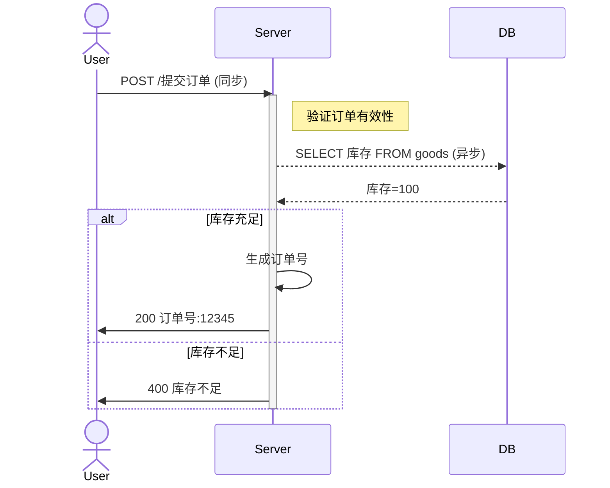
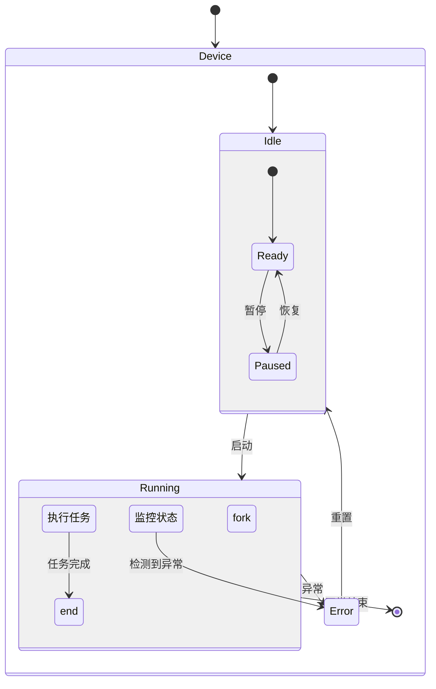

# Mermaid实时预览工具使用说明

## 功能特性
- 实时预览Mermaid图表（支持流程图/时序图/类图/状态图/甘特图）
- 自动保存编辑器内容到本地存储
- 支持主题切换（default/dark/forest/neutral）
- 快捷键操作：Ctrl+S保存 | Ctrl+R重置

## 安装步骤
1. 确保已安装Python 3.6+
2. 执行 `pip install -r requirements.txt`

## 运行方法
```bash
# 默认端口启动
python app.py

# 指定端口启动
python app.py --port 8080
```

访问地址：http://localhost:5000 （端口与启动参数一致）

## Mermaid语法支持
### 基础规则说明
Mermaid通过文本描述生成图表，核心语法包含节点定义、关系连接符和特殊符号三类要素。以下为各类型图表的具体语法规则及扩展示例：

#### 1. 流程图（Flowchart）
- **节点定义**：
  - 矩形节点：`节点ID[节点文本]`（默认形状，用于普通步骤，如用户注册）
  - 圆角矩形：`节点ID(节点文本)`（用于流程中的子流程或模块，如支付子流程）
  - 菱形判断：`节点ID{节点文本}`（用于条件判断分支，如库存校验）
  - 圆形开始/结束：`节点ID((节点文本))`（仅用于流程起点/终点，如订单创建/完成）
  - 子图容器：`subgraph 子图标题
    ...节点定义
  end`（用于分组相关节点，如将用户操作集中展示）
  - 自定义样式：通过`classDef`定义样式（如颜色、字体），并通过`class 节点ID 样式名`应用（示例：`classDef warning fill:#FFE5B4,stroke:#FFA500; class Warning warning`）

- **边连接符使用场景**：
  - 无向边（`--`/`---`）：适用于数据同步、双向通信等无明确方向的场景（如`DB -- 数据同步 --> Cache`）
  - 单向边（`-->`/`--->`）：短箭头用于常规流程（如信息提交→验证），长箭头（`--->`）强调关键路径（如支付成功--->订单完成）
  - 带标签边（`-- 标签 -->`/`|标签|-->`）：标签在上用于简短说明（如`-- 库存充足 -->`），标签在下适合长描述（如`|优惠券抵扣10元|-->`）
  - 虚线边（`-.->`）：表示可选或临时操作（如`用户 -.-> 选择优惠券`）

**复杂业务示例（电商订单处理）**：
```mermaid
flowchart TB
    classDef startEnd fill:#90EE90,stroke:#228B22
    classDef process fill:#87CEFA,stroke:#4169E1
    classDef decision fill:#FFB6C1,stroke:#FF69B4
    class Start,End startEnd; Input,Pay,Save process; Validate,CheckStock decision

    subgraph 用户操作
      Start((订单创建)) -->|填写地址| Input[收货信息录入]
      Input --> Validate{信息完整?}
    end
    Validate -- 是 -->|提交| CheckStock{库存校验}
    Validate -- 否 -->|提示补全| Input
    CheckStock -- 充足 -->|进入支付| Pay[支付网关处理]
    CheckStock -- 不足 -->|通知用户| Warning[(库存不足提示)]
    Pay --> Check{支付成功?}
    Check -- 是 -->|更新状态| Save[订单信息存档]
    Check -- 否 -->|重试支付| Pay
    Save --> End((订单完成))
    Warning --> End((订单关闭))
```
注：示例中通过`classDef`定义了不同节点样式（绿色开始/结束、蓝色流程、粉色判断），使用长箭头强调支付关键路径，虚线边表示可选提示操作

#### 2. 时序图（Sequence Diagram）
- **参与者声明**：`participant 名称`（普通参与者）/ `actor 名称`（带人形图标，用于用户角色）/ `rect 名称`（矩形框参与者）
- **消息类型**：
  - 实心箭头：`->>`（同步消息，发送方等待响应）
  - 虚线箭头：`-->>`（异步消息，发送方不等待）
  - 返回消息：`-->`（无箭头返回，用于简单确认）
  - 自环消息：`->>`（参与者自身消息，如`User->>User: 输入确认`）
- **激活状态**：`activate 参与者`（标注处理中，默认持续到下一个消息）/ `deactivate 参与者`（手动结束激活）
- **注释**：`note left of 参与者: 注释内容`（左侧注释）/ `note right of 参与者: 注释内容`（右侧注释）

**示例**：


#### 3. 类图（Class Diagram）
- **类定义**：`class 类名`（普通类）/ `abstract class 类名`（抽象类）/ `interface 类名`（接口）
  - 属性格式：`可见性 类型 名称`（如`+ String username`）
  - 方法格式：`可见性 返回类型 名称(参数)`（如`- void saveData()`）
- **关系符号**：
  - 继承：`<|--`（子类→父类，如`Dog <|-- Animal`）
  - 实现：`<|..`（实现类→接口，如`Cat <|.. Pet`）
  - 关联：`-->`（单向关联，如`Owner --> Pet`）
  - 聚合：`o--`（整体与部分可分离，如`Team o-- Member`）
  - 组合：`*--`（整体与部分不可分离，如`Car *-- Engine`）
  - 依赖：`..>`（临时使用，如`Service ..> Database`）

**示例**：
```mermaid
classDiagram
    abstract class Animal {
        #string habitat
        +abstract void move()
        +void eat()
    }
    interface Pet {
        +void play()
        +String getName()
    }
    class Dog {
        -string breed
        +void bark()
    }
    class Cat {
        +int age
        +void meow()
    }
    Dog <|-- Animal
    Cat <|-- Animal
    Dog <|.. Pet
    Cat <|.. Pet
    class PetShop {
        +List<Pet> pets
        +void sell(Pet): void
    }
    PetShop --> Pet
```

#### 4. 状态图（State Diagram）
- **状态声明**：`状态名`（普通状态）/ `[*]`（初始状态）/ `end`（结束状态）/ `[*] --> end`（直接结束）
- **转移规则**：`状态 --> 目标状态 : 触发事件`（基础转移）/ `状态 --> 状态 : 自转移事件`（状态内循环）
- **复合状态**：
  - 顺序子状态：`状态 { [*] --> 子状态1 --> 子状态2 }`（按顺序执行）
  - 并行子状态：`状态 { fork
    子状态A
    ---
    子状态B
    end }`（同时执行）
  - 历史状态：`状态 { history h }`（恢复上次子状态）

**示例**：


#### 5. 甘特图（Gantt）
- **任务定义**：`section 阶段名`（定义任务分组） + `任务名 : 标签, 开始时间, 持续时间`（基础任务）/ `任务名 : crit, 标签, 开始时间, 持续时间`（关键路径任务）
- **时间单位**：`d`（天，默认）、`h`（小时，如`3h`）、`m`（分钟，如`30m`）
- **依赖关系**：`任务名 : 依赖任务名`（单一依赖）/ `任务名 : 依赖1, 依赖2`（多依赖）/ `任务名 : after 依赖名`（依赖完成后开始）
- **进度标记**：`任务名 : done, 标签, 开始时间, 持续时间`（已完成任务）/ `任务名 : active, 标签, 开始时间, 持续时间`（进行中任务）

**示例**：
```mermaid
Gantt
    title 电商系统开发计划
    dateFormat  YYYY-MM-DD
    excludes weekdays 2024-01-01
    section 需求阶段
    需求调研       :a1, 2024-01-02, 5d
    原型设计       :a2, crit, after a1, 7d
    需求评审       :a3, after a2, 2d
    section 开发阶段
    后端开发       :b1, 2024-01-20, 14d
    前端开发       :b2, active, 2024-01-20, 12d
    数据库设计     :b3, after a3, 5d
    section 测试阶段
    单元测试       :c1, after b1, 7d
    集成测试       :c2, after b2, 5d
    验收测试       :c3, after c1, c2, 3d`
```

## 注意事项
1. 浏览器兼容：Chrome 90+ / Firefox 88+ / Edge 94+
2. 图表复杂度限制：最多50个节点
3. 中文显示需使用标准字体
4. 本地存储空间限制：5MB

## 常见问题
### 图表渲染异常
✅ 检查语法闭合标签
✅ 确认没有使用注释语法
✅ 清除浏览器缓存后重试

### 服务启动失败
✅ 检查Python环境变量配置
✅ 确认端口未被占用
✅ 查看flask日志输出

### 界面无响应
✅ 刷新浏览器页面
✅ 检查控制台错误信息
✅ 确保网络连接正常